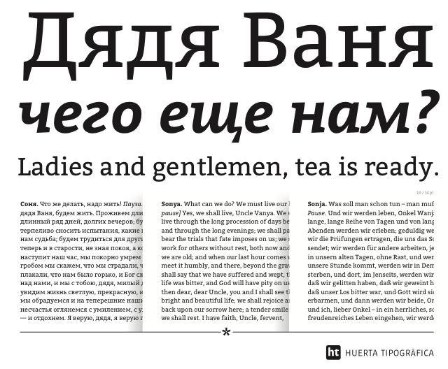

### Bitter

by Sol Matas for Huerta Tipográfica

People read and interact with text on screens more and more each day. What happens on screen ends up being more important than what comes out of the printer. With the accelerating popularity of electronic books, type designers are working hard to seek out the ideal designs for reading on screen.

Motivated by my love for the pixel I designed Bitter. A "contemporary" slab serif typeface for text, it is specially designed for comfortably reading on any computer or device. The robust design started from the austerity of the pixel grid, based on rational rather than emotional principles. It combines the large x-heights and legibility of the humanistic tradition with subtle characteristics in the characters that inject a certain rhythm to flowing texts.

Bitter has little variation in stroke weight and the Regular is thicker than a normal ‘Regular’ style for print design. This generates an intense color in paragraphs, accentuated by the serifs that are as thick as strokes with square terminals.

Each glyph is carefully designed with an excellent curve quality added to the first stage of the design, that was entirely made in a pixel grid. The typeface is balanced and manually spaced to use very few kerning pairs, especially important for web font use since most browsers do not currently support this feature.

Early versions of the Italic and Bold styles were added in December 2011 and will be updated and complemented by a Bold Italic in early 2012.

Designed by Sol Matas for Huerta Tipográfica

### Downloads

* [View Bitter on Google Fonts](https://fonts.google.com/specimen/Bitter)

* [Download TTF/OTFs from git](https://github.com/solmatas/Bitter/releases/tag/v.2.110)

* [Download Bitter from Huerta Tipográfica](http://huertatipografica.com/en/fonts/bitter-ht)

### Vietnamese

Vietnamese support was added by Nhung Nguyen <vns.wonderland@gmail.com> on 30 September 2016. 

### Cyrillic Expansion

Core Cyrillic glyphs were drawn by Sol Matas in 2013 with consultancy from Alexei Vanyashin. 

Bitter has been expanded to GF Cyrillic Plus, Pro and localised language variants (Bulgarian, Serbian, Macedonian) on 26 August 2016 (v.2.000) by Cyreal [ [Cyreal.org](http://www.cyreal.org/) ]

### Copyright

Copyright (c) 2011-2015, Sol Matas (www.huertatipografica.com), with Reserved Font Name "Bitter". Copyright (c) Bitter project Authors

### License

This Font Software is licensed under the SIL Open Font License, Version 1.1.
This license is copied below, and is also available with a FAQ at:
http://scripts.sil.org/OFL

